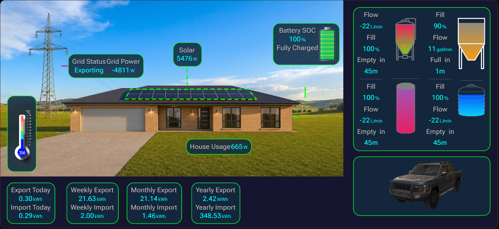

# Energy Canvas

A configurable Home Assistant dashboard card: place energy cards (labels, values,
icons) **freely over a background image**, with day/night and EV-count background
variants. Pure HTML/CSS rendering — no SVG scene to wrestle.

test

> Greenfield successor to **Advanced Energy Card** for the overview use case.
> See [DESIGN.md](./DESIGN.md) for the full architecture and roadmap.

> ⚠️ Early development (v0.1.0). The renderer + background system are the current
> focus; the visual placement editor and onboarding wizard come next.

## Status / Roadmap

- **M1 — Turnkey core:** schema + HTML/CSS renderer + background system + supplied-set path *(in progress)*
- **M2 — Flexibility:** own-images path + visual placement editor + onboarding wizard
- **M3 — Content:** full field config, calculated/aggregated fields, state-linked colors, popups
- **M4 — Polish:** crossfade, battery fill, sun/moon arc, localization, perf pass

## Development

```bash
npm install        # one-time
npm run dev        # vite build --watch -> dist/energy-canvas-card.js
npm run build      # production bundle
npm run typecheck  # tsc --noEmit
```

The build emits a single self-contained ES module at `dist/energy-canvas-card.js`,
which HACS serves.

### Local testing

`deploy.ps1` builds and copies the bundle into the local Home Assistant `www`
folder (`Y:\www\community\energy-canvas-card`):

```powershell
./deploy.ps1
```

Then add the Lovelace resource (once) as a **JavaScript Module**:
`/local/community/energy-canvas-card/energy-canvas-card.js`, and hard-reload the
browser after each deploy to bust the cache.

## Example configuration

```yaml
type: custom:energy-canvas
aspect_ratio: "1.94"
background:
  source: auto          # auto (sun) | day | night | entity
  sun_entity: sun.sun
  fit: cover            # cover | contain
  images:
    day:
      "0": /local/energy-canvas/day_no_ev.jpg
      "1": /local/energy-canvas/day_1ev.jpg
    night:
      "0": /local/energy-canvas/night_no_ev.jpg
      "1": /local/energy-canvas/night_1ev.jpg
ev_count: 0
fields: []
```

## License

[MIT](./LICENSE) © Brent Wesley
